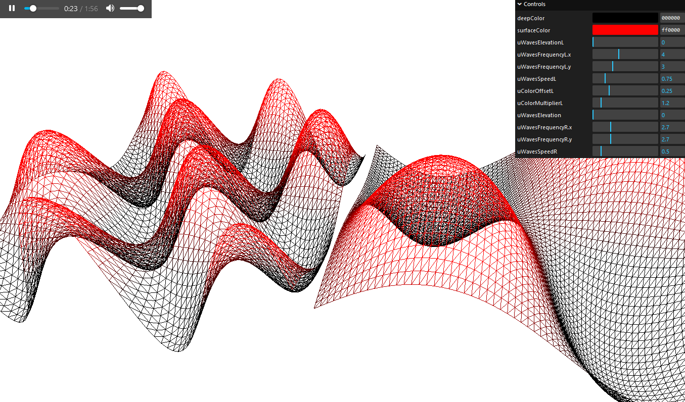

# Lightning
## A Three.js Web Audio API experiment.

Lightning visualizes audio data in 3D. It splits channels and measures audio
frequencies to determine the speed and strength of its visualization.

Ultimately it reached a terminal point due to limitations of the native
web audio API. That's OK; it's still fun and cool.



## Setup
Download [Node.js](https://nodejs.org/en/download/).
Run this followed commands:

``` bash
# Install dependencies (only the first time)
npm install

# Run the local server at localhost:8080
npm run dev

# Build for production in the dist/ directory
npm run build
```
